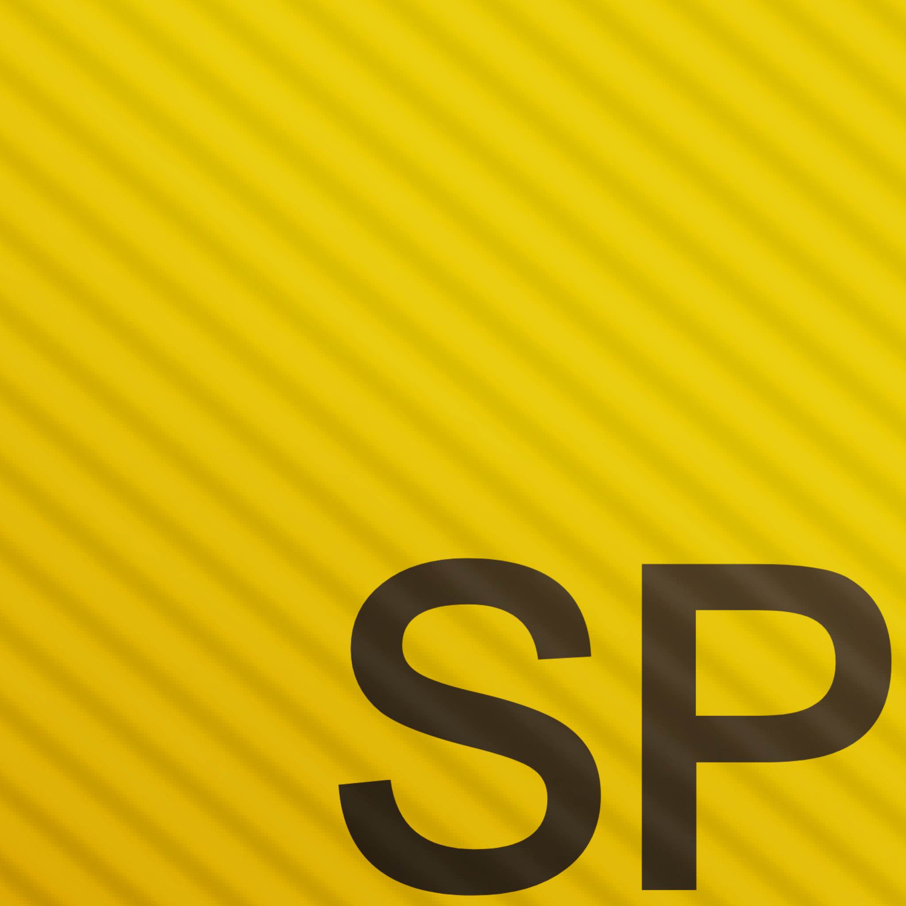

#  Speckle (.spk)

> A clean, lightweight, visual programming language built for speed, simplicity, and geometric creation.

[](https://github.com/n1nerlang/speckle-lang)
[](https://www.python.org)
[](https://www.lua.org)
[](LICENSE)

---

Speckle is an interpreted, expressions-first language designed to bridge mathematical computation with native turtle graphics rendering. Its syntax is heavily inspired by Lua—featuring elegant function calls and lightweight block structures—making it highly accessible for developers.

## 🌟 Key Features

* **Native Geometric Runtime:** Move objects, paint canvases, and render vectors natively using built-in engine commands.
* **Flexible Extensions:** Supports multiple recognized file formats: `.spk`, `.speckle`, `.sp`, and `.pk`.
* **Isolated Environments:** A sandbox-safe global execution context mimicking classic registry paradigms.
* **TextMate Native Syntax:** Custom token mappings ready for GitHub Linguist integration.

---

## 🏗️ Architecture Pipeline

The Speckle compilation pipeline steps through three key phases to take your code from plain text to raw execution output:

```text
  [ Raw Source Code ] (.spk / .sp / .pk)
           │
           ▼
   ┌───────────────┐
   │  1. Lexer     │ ──► Regular Expression Tokenizer
   └───────────────┘
           │
           ▼
   ┌───────────────┐
   │  2. Parser    │ ──► Top-Down Recursive Descent State Machine
   └───────────────┘
           │
           ▼
  [ Abstract Syntax Tree (AST) ] (Structural Data Object Branches)
           │
           ▼
   ┌───────────────┐
   │3. Interpreter │ ──► Dynamic Execution Sandbox & Runtime Loops
   └───────────────┘
           │
           ▼
  [ Screen Output / Visual Graphic Rendering Canvas ]
